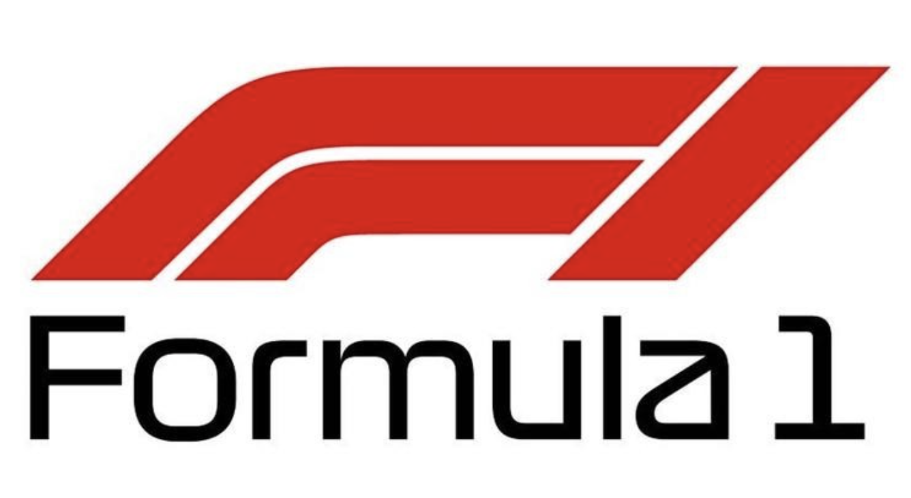

# Formula 1 Finishing Position Predictor



## Overview

Welcome to the Formula 1 Finishing Position Predictor! This project leverages machine learning techniques to predict the finishing positions of Formula 1 drivers based on historical data and various performance metrics. The model takes into account starting grid positions, driver and team performance, track-specific data, and more to provide accurate race outcome predictions.

## Features

- **Historical Data Analysis:** Utilizes data from past races to inform predictions.
- **Multiple Performance Metrics:** Considers starting grid position, driver and team averages, form, and interaction metrics.
- **Polynomial Features:** Enhances the model with polynomial feature transformations for better accuracy.
- **Hyperparameter Tuning:** Optimizes the model using GridSearchCV for the best performance.

## Data Sources

- Historical race data from 2021-2023
- Current 2024 season data so far 

## Installation

1. Clone the repository:
    ```sh
    git clone https://github.com/yourusername/f1-finishing-position-predictor.git
    cd f1-finishing-position-predictor
    ```

2. Install the required packages:
    ```sh
    pip install -r requirements.txt
    ```

## Usage

1. **Prepare the Data:**
    Load and clean the data using the provided script.
    ```python
    combined_data = pd.read_csv("cleaned_data/combined_data.csv")
    ```

2. **Select Features and Target:**
    ```python
    features = combined_data[['Starting Grid', 'driver_avg_starting_position', 'driver_avg_finishing_position', 
                              'team_avg_starting_position', 'team_avg_finishing_position', 'track_driver_avg_finishing_position', 
                              'track_team_avg_finishing_position', 'driver_form', 'team_form', 'driver_team_interaction', 
                              'track_starting_grid_interaction', 'driver_track_interaction', 'team_track_interaction', 
                              'team_podium_count', 'driver_podium_count', 'team_win_count', 'driver_win_count']]
    target = combined_data['Position']
    ```

3. **Transform Features:**
    ```python
    poly = PolynomialFeatures(degree=2, interaction_only=True, include_bias=False)
    features_poly = poly.fit_transform(features)
    ```

4. **Train the Model:**
    ```python
    param_grid = {
        'n_estimators': [100, 200, 300],
        'max_depth': [None, 10, 20, 30],
        'min_samples_split': [2, 5, 10],
        'min_samples_leaf': [1, 2, 4]
    }
    model = RandomForestRegressor(random_state=42)
    grid_search = GridSearchCV(estimator=model, param_grid=param_grid, cv=5, n_jobs=-1, verbose=2)
    grid_search.fit(X_train, y_train)
    best_model = grid_search.best_estimator_
    ```

5. **Evaluate the Model:**
    ```python
    y_pred = best_model.predict(X_test)
    mse = mean_squared_error(y_test, y_pred)
    r2 = r2_score(y_test, y_pred)
    print(f"Mean Squared Error: {mse}")
    print(f"R^2 Score: {r2}")
    ```

## Results

- **Best Parameters:** The optimal parameters found by GridSearchCV.
- **Mean Squared Error:** The MSE of the model on the test data.
- **R² Score:** The R² score of the model on the test data.

## Contributing

I am open to suggestions on how to make this code more accurate. Check out my [GitHub repository](https://github.com/yourusername/f1-finishing-position-predictor) and feel free to message me about collaborating to enhance this model!

## Contact

Feel free to reach out if you have any questions or suggestions. You can contact me via:

- LinkedIn: [Your LinkedIn Profile](https://www.linkedin.com/in/jstone5/)
